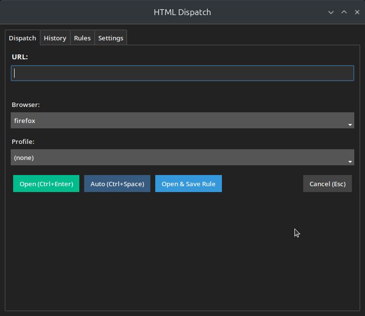

# htmldispatch

A URL dispatcher for Linux that routes URLs to the right browser and profile based on regexp rules.

Instead of opening every link in the same browser, htmldispatch lets you automatically send GitHub URLs to Firefox with your work profile, Teams links to Chrome, and so on — all configurable with regex patterns.



## Features

- **Regexp-based URL routing** — match URLs with regex patterns and dispatch to specific browsers and profiles
- **Firefox multi-profile support** — opens URLs directly in the correct Firefox profile using `--profile`
- **Chrome profile support** — route to specific Chrome profile directories
- **Smart fallback chain** — when no rule matches: exact URL history → domain history → last used → default
- **Intercept mode** — optionally show a popup for unmatched URLs to choose the destination
- **Arrow key navigation** — press Up/Down to cycle through previously used browser/profile combinations
- **History log** — tracks all dispatched URLs with timestamps
- **Re-dispatch** — open the manager, pick a URL from history, and send it to a different browser
- **YAML config** — edit rules by hand or through the GUI
- **Keyboard shortcuts** — Ctrl+Enter to open, Ctrl+Space to auto-dispatch, Esc to cancel

## Install

Requires Python 3.10+ and [uv](https://docs.astral.sh/uv/).

```bash
git clone https://github.com/knobo/htmldispatch.git
cd htmldispatch
uv sync
./install.sh
```

This will:
1. Install dependencies in a local `.venv`
2. Create a wrapper script at `~/.local/bin/htmldispatch`
3. Install the `.desktop` file
4. Set htmldispatch as the default URL handler for `http://` and `https://`

## Usage

URLs are dispatched automatically when you click links in other applications:

```
htmldispatch "https://github.com/myorg/myrepo"
```

Open the manager GUI to view history, edit rules, or re-dispatch URLs:

```
htmldispatch --manage
```

## Configuration

Config file: `~/.config/htmldispatch/config.yaml`

```yaml
popup_on_unknown: true
default_browser: firefox
default_profile: null
rules:
- name: Work GitHub
  pattern: https?://github\.com/myorg
  browser: firefox
  profile: Work
- name: Teams
  pattern: https?://teams\.microsoft\.com
  browser: chrome
  profile: null
- name: Teams links
  pattern: https?://.*\.teams\.microsoft\.com
  browser: chrome
  profile: null
```

### Rules

Each rule has:

| Field | Description |
|-------|-------------|
| `name` | Display name for the rule |
| `pattern` | Python regex matched against the full URL |
| `browser` | `firefox` or `chrome` |
| `profile` | Firefox profile name, Chrome profile directory, or `null` |

Rules are evaluated top-to-bottom — first match wins.

### Dispatch logic

**When intercept is off** (`popup_on_unknown: false`), URLs are opened automatically:

1. Regexp rules (first match)
2. Exact URL history (last used browser/profile for this URL)
3. Domain history (same domain + first path segment)
4. Global default

**When intercept is on** (`popup_on_unknown: true`), matching rules dispatch automatically. Unmatched URLs show the popup pre-filled using the same fallback chain. Use arrow keys to cycle through alternatives from history.

### Keyboard shortcuts

| Key | Action |
|-----|--------|
| `Ctrl+Enter` | Open with selected browser/profile |
| `Ctrl+Space` | Auto-dispatch using fallback chain |
| `Up/Down` | Cycle through history destinations |
| `Esc` | Cancel |

## Uninstall

```bash
rm ~/.local/bin/htmldispatch
rm ~/.local/share/applications/htmldispatch.desktop
update-desktop-database ~/.local/share/applications
xdg-settings set default-web-browser firefox.desktop
```

## License

MIT
